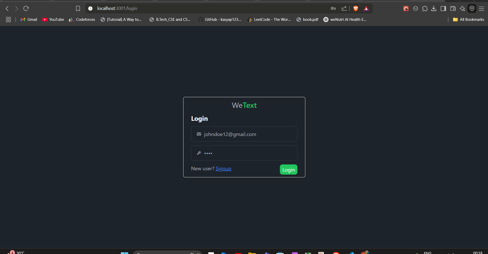
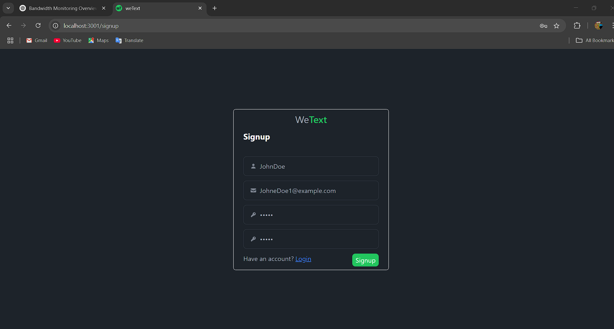
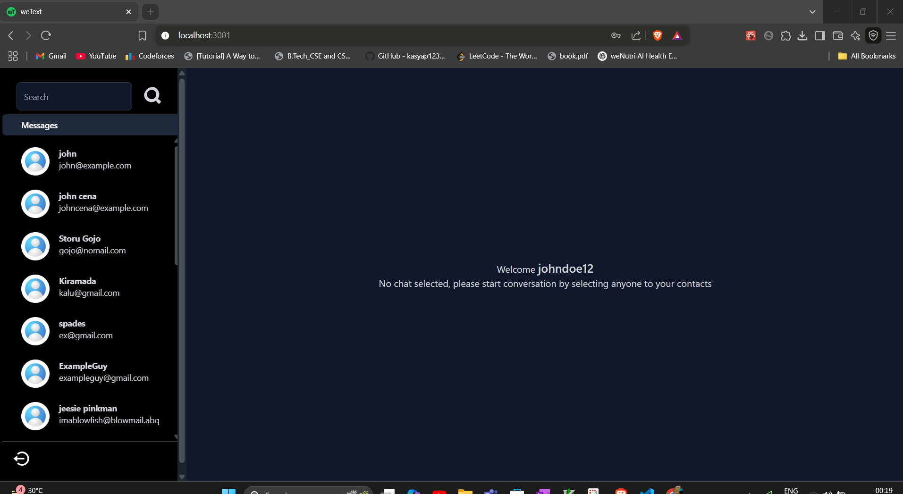

💬 weText

Hey there! 👋 Welcome to weText, my real-time chat app built with the MERN stack (MongoDB, Express, React, Node.js). Whether you want to chat with friends, create multiple channels, or just see real-time updates, weText has you covered. ⚡

I built it to explore Socket.IO, Zustand, and modern React patterns while keeping a smooth, responsive experience for both desktop and mobile users.

🚀 Features

🔐 User Authentication – Sign up and log in securely

💬 Real-time Messaging – Chat instantly thanks to Socket.IO

🧑‍🤝‍🧑 Multiple Chat Rooms – Keep conversations organized

🗂 State Management with Zustand – Fast, lightweight, and efficient

🌓 Responsive UI – Looks great on phones, tablets, and desktops

🌐 MERN Stack Architecture – Clean separation of frontend and backend

📸 Sneak Peek

Here’s a glimpse of the app in action:

## 📸 App Screenshots

| Login Screen | Signup Screen | Homepage |
|--------------|---------------|----------|
|  |  |  |

## 🔔 Notification Sound

> Notification audio used: [notification.mp3](frontend/src/assets/notification.mp3)

## 👤 User Avatar

> Default avatar:  
> 

## 🎥 Demo Video

> [Watch Demo (MP4)](frontend/src/assets/demoweText.mp4)

## 📂 Project Structure
🛠️ Getting Started
📋 Prerequisites

Node.js and npm installed

MongoDB (local or cloud e.g., MongoDB Atlas)

🔧 Installation

Clone the repo:

git clone https://github.com/prakhaaar/weText.git
cd weText

1️⃣ Backend Setup
cd backend
npm install

Create a .env file in /backend and add your MongoDB URI:

MONGO_URI=your_mongodb_connection_string

Start the server:

npm start

2️⃣ Frontend Setup
cd ../frontend
npm install
npm start

Open http://localhost:3000
 to see it in action! 🌟

🤝 Contributing

Want to make weText even cooler? Contributions are always welcome!

Fork the repo

Create your feature branch (git checkout -b feature/my-feature)

Commit your changes (git commit -m 'Add some feature')

Push to the branch (git push origin feature/my-feature)

Open a pull request

📄 License

This project is licensed under the MIT License.
